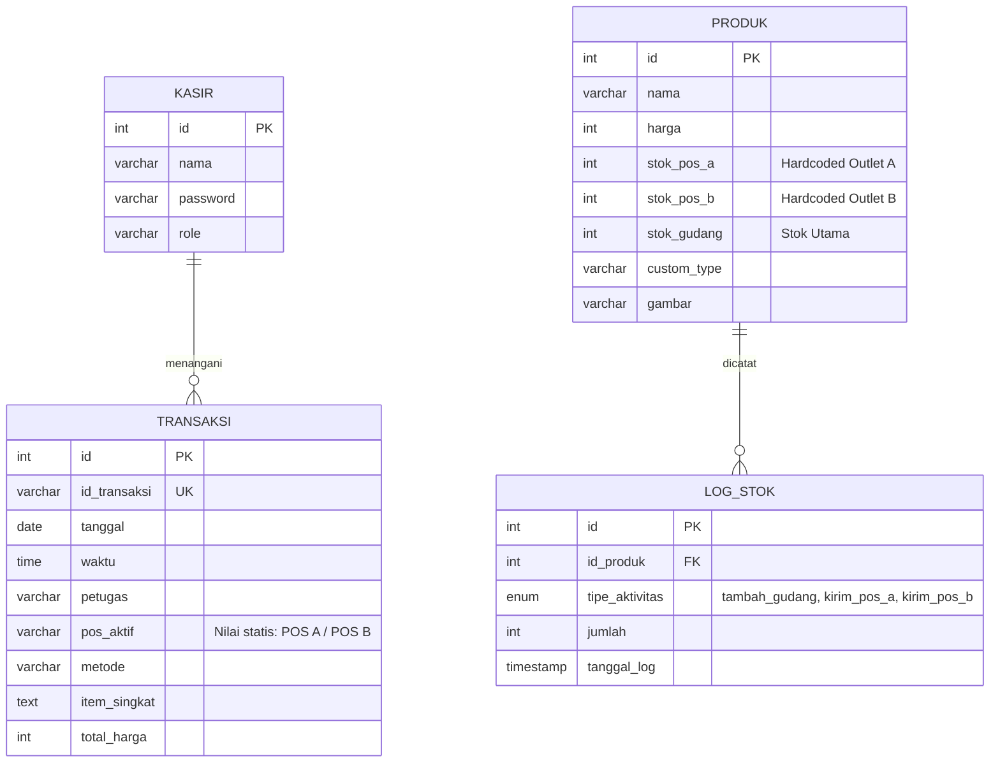

# LAPORAN ANALISIS STRUKTUR SISTEM SEBELUM PERUBAHAN (PRE-CHANGE ANALYSIS REPORT)
**Instansi / Mitra:** PT Taman Wisata Candi Borobudur, Prambanan & Ratu Boko (Unit Borobudur)  
**Program:** Laporan Kerja Praktik (KP) - Pengembangan Sistem POS Multi-Outlet  
**Project:** Veloce POS (Multi-Outlet & Vending Machine Expansion)  
**Dokumen:** Analisis & Pemahaman Struktur Baseline Codebase  
**Tanggal:** 01 September 2026  
**Status:** Baseline Audited & Verified  

---

## 1. PENDAHULUAN & TUJUAN AUDIT
Laporan ini disusun sebagai tahapan **wajib (prerequisite)** sebelum melakukan intervensi atau modifikasi kode sumber pada aplikasi **Veloce POS**. Tujuannya adalah memetakan arsitektur eksisting, struktur basis data, alur bisnis (business flow), ketergantungan (dependencies), serta mengidentifikasi celah/limitasi (bottleneck) arsitektur lama agar penambahan fitur baru dapat berjalan lancar tanpa merusak data transaksi dan fungsionalitas yang telah berjalan.

---

## 2. ARSITEKTUR FILE & KOMPONEN EKSISTING

Sistem dibangun menggunakan arsitektur **PHP Native (Procedural)** terintegrasi dengan MariaDB/MySQL, Tailwind CSS (via CDN), Chart.js, dan JavaScript Vanilla.

| File / Direktori | Fungsi Utama | Dependensi / Keterkaitan | Status Saat Ini |
| :--- | :--- | :--- | :--- |
| [`index.php`](file:///c:/xampp/htdocs/pos/index.php) | Antarmuka Kasir (POS), Autentikasi Kasir/Admin, Point of Sale, Keranjang Belanja, Modal Pembayaran, Cetak Struk, dan AJAX Simpan Transaksi. | Koneksi MySQLi langsung, tabel `produk`, `transaksi`, `kasir`. | **Hardcoded** 2 terminal (`POS A`, `POS B`). |
| [`dashboard.php`](file:///c:/xampp/htdocs/pos/dashboard.php) | Panel Administrator / Owner: Analisis Omzet, Grafik Stok, Manajemen Akun Kasir, Tambah/Edit Menu, dan Distribusi Stok Gudang. | Session `admin_logged_in`, Chart.js CDN, folder `uploads/`. | Kolom stok hardcode (`stok_pos_a`, `stok_pos_b`). |
| [`login.php`](file:///c:/xampp/htdocs/pos/login.php) | Halaman login alternatif untuk membedakan session Kasir dan Owner. | Tabel `kasir`, session PHP. | Hardcoded kredensial owner fallback (`admin`/`admin`). |
| [`api.php`](file:///c:/xampp/htdocs/pos/api.php) | REST API endpoint (`GET` riwayat transaksi, `POST` input transaksi eksternal). | Tabel `transaksi`. | Bersifat general, belum memetakan multi-outlet dinamis. |
| [`veloce_pos (1).sql`](file:///c:/xampp/htdocs/pos/veloce_pos%20%281%29.sql) | DDL & DML skema database awal per 01 September 2026. | Engine InnoDB, collation `utf8mb4_general_ci`. | Skema flat/non-dinamis pada kolom outlet. |
| `uploads/` | Direktori penyimpanan berkas gambar produk yang diunggah dari form menu dashboard. | Dipanggil di `index.php` dan `dashboard.php`. | Berfungsi normal. |

---

## 3. ANALISIS STRUKTUR DATABASE EKSISTING (`veloce_pos`)

Terdapat 4 tabel utama pada database awal:



### Rincian Tabel Eksisting:
1. **Tabel `produk`**:
   - `id`, `nama`, `harga`, `custom_type`, `gambar`, `stok_gudang`.
   - **Kelemahan Kritis:** Memiliki kolom statis `stok_pos_a` dan `stok_pos_b`. Model ini tidak scalable karena jika outlet bertambah menjadi 11 lokasi (9 Vending Machine + 2 Outlet), penambahan kolom secara horizontal (`stok_vm1`, `stok_vm2`, ...) adalah bad practice dalam perancangan database relasional normalisasi (1NF/2NF/3NF).
2. **Tabel `transaksi`**:
   - `id_transaksi` (varchar unik, format `TRX-XXXXXX`).
   - `pos_aktif`: tipe string dengan nilai default `'POS A'`, belum terhubung ke master data outlet melalui foreign key.
   - `item_singkat`: string agregat ringkas produk yang dibeli (misal: `"2x Aqua Botol, 1x Frestea"`).
3. **Tabel `log_stok`**:
   - `tipe_aktivitas`: bertipe `ENUM('tambah_gudang','kirim_pos_a','kirim_pos_b')`.
   - **Kelemahan Kritis:** Enum ini terkunci kaku pada 2 pos saja. Tidak dapat mencatat pengiriman ke 11 lokasi baru atau mutasi transfer antar outlet.
4. **Tabel `kasir`**:
   - Menyimpan akun login petugas kasir dan admin (`role: 'kasir' / 'admin'`).

---

## 4. ANALISIS ALUR PROSES BISNIS SAAT INI (EXISTING WORKFLOW)

### A. Alur Login & Hak Akses
1. Pengguna membuka [`index.php`](file:///c:/xampp/htdocs/pos/index.php) atau [`login.php`](file:///c:/xampp/htdocs/pos/login.php).
2. Terdapat pilihan Role (`Kasir` vs `Admin`).
3. Jika memilih `Kasir`: Wajib memilih Terminal POS dari dropdown statis (`POS A` atau `POS B`).
4. Jika login valid, session `$_SESSION['pos_aktif']` dan `$_SESSION['kasir_nama']` diset.

### B. Alur Transaksi Kasir (POS)
1. Seluruh daftar produk di-load dari tabel `produk` tanpa seleksi lokasi (`SELECT * FROM produk`).
2. Kasir memilih produk, opsi varian (suhu dingin/normal), dan memasukkan ke keranjang (cart JavaScript).
3. Saat tombol bayar ditekan, AJAX mengirim payload JSON ke `index.php?action=simpan_transaksi`.
4. Backend mengecek ketersediaan stok menggunakan percabangan statis:
   ```php
   $kolom_stok = ($pos_aktif === 'POS B') ? 'stok_pos_b' : 'stok_pos_a';
   ```
5. Jika stok mencukupi, baris transaksi disimpan ke `transaksi` dan kolom stok produk bersangkutan dikurangi langsung.

### C. Alur Manajemen Stok & DO (Gudang ke POS)
1. Di [`dashboard.php?page=stok`](file:///c:/xampp/htdocs/pos/dashboard.php), admin dapat:
   - Menambah stok masuk ke Gudang Utama (`UPDATE produk SET stok_gudang = stok_gudang + X`).
   - Mengirim DO ke POS A atau POS B melalui radio button.
2. Pengiriman DO langsung memotong `stok_gudang` dan menambah `stok_pos_a` atau `stok_pos_b`, lalu mencatat entri ke `log_stok`.

---

## 5. TEMUAN KETERBATASAN & GAP TERHADAP SPESIFIKASI BARU

Berdasarkan hasil audit sistem eksisting terhadap **10 Scope Pengembangan yang Ditugaskan**, berikut adalah peta kesenjangannya:

| No | Modul / Kebutuhan Baru | Kondisi Sistem Eksisting | Analisis Kesenjangan (Gap) & Risiko |
| :--- | :--- | :--- | :--- |
| **1** | **Grafik Penjualan / Omzet** | Grafik stok hanya membandingkan Gudang vs POS A vs POS B. Grafik omzet hanya menampilkan performa per kasir dan produk terlaris tanpa tren temporal komprehensif. | Perlu perbaikan query agregasi omzet harian/mingguan/bulanan, visualisasi Chart.js interaktif, filter per outlet/mesin, dan kalkulasi omzet bersih. |
| **2** | **11 Lokasi Mesin / Outlet** (VM 1–9, Outlet Museum Samudra Raksa, Outlet Refreshment Barat) | Sistem hanya mengenali 2 outlet (`POS A` dan `POS B`) yang di-hardcode di kode program dan skema tabel. | **Kritis:** Harus dibuat tabel relasional `outlets` dinamis dan tabel relasi `stok_outlet` agar 11 lokasi dapat dikelola secara modular tanpa menambah kolom tabel. |
| **3** | **Tambah / Edit POS** | Tidak ada master data POS/Outlet. Penambahan outlet baru harus merombak struktur database dan script PHP secara manual. | Diperlukan antarmuka CRUD Master POS/Outlet di Dashboard dengan properti tipe (Vending Machine vs Outlet Fisik). |
| **4** | **Kategori Retur Rusak / Expired** | Belum ada mekanisme pencatatan retur. Pengurangan stok hanya terjadi saat transaksi kasir. | Diperlukan tabel pencatatan retur dengan klasifikasi alasan (Rusak Fisik, Kemasan Rusak, Expired, dll). |
| **5** | **Pengembangan DO Antar Lokasi** | DO hanya satu arah dari Gudang ke POS A/B. Tidak mendukung mutasi antar cabang/mesin. | Perlu dropdown dinamis Lokasi Asal dan Lokasi Tujuan, penomoran nota DO resmi, serta pelacakan status DO. |
| **6** | **Pengelolaan Barang Rusak** | Barang rusak tidak terlacak, jika ada barang cacat stok hanya bisa disesuaikan manual via edit menu. | Barang rusak harus dapat dialokasikan/dikirim ke Outlet atau VM khusus karantina/retur dengan pengurangan stok otomatis. |
| **7** | **Tabel Retur & Barang Rusak** | Tidak tersedia tabel atau halaman tampilan retur di dashboard. | Perlu view tabel lengkap mencatat tanggal, nama barang, jumlah, lokasi asal, lokasi tujuan, kategori alasan, dan nama petugas. |
| **8** | **Log Export PDF / Excel** | Tidak ada fitur ekspor data. Data hanya bisa dilihat di layar browser. | Perlu integrasi library ekspor / generator CSV-Excel dan print/PDF layout laporan yang rapi. |
| **9** | **Redesign UI Glassmorphism** | UI kasir bertema dark standar (`bg-slate-950`), dashboard bertema putih kaku (`bg-slate-50`). Belum ada nuansa modern glass. | Diperlukan standarisasi CSS dengan aksen Frosted Glass (backdrop-filter blur, border transparan semi-putih, shadow lembut) yang responsif dan user-friendly. |
| **10**| **Logic Produk per Outlet** | Seluruh produk tampil seragam di semua kasir tanpa pembatasan outlet. | Perlu tabel relasi ketersediaan produk (`produk_outlet_visibility`): Opsi Khusus 1 Outlet, Grup Outlet (A, B, C), atau Tersedia di Semua Outlet. |

---

## 6. STRATEGI IMPLEMENTASI ARSITEKTUR TARGET & MITIGASI DATA

Arsitektur target tidak sekadar menambah 11 kolom outlet, melainkan melakukan normalisasi ke sistem relasional yang scalable:

```text
                    VELOCE POS
                        │
          ┌─────────────┴─────────────┐
          │                           │
     MASTER DATA                 TRANSAKSI
          │                           │
   ┌──────┼──────┐             ┌──────┴──────┐
   │      │      │             │             │
Produk  Outlet  Kasir       Penjualan       DO
   │      │                    │             │
   │      │             transaksi_detail     │
   │      │                    │             │
   └──────┼────────────────────┘             │
          │                                  │
     stok_outlet ◄───────────────────────────┘
          │
     ┌────┴─────┐
     │          │
  Stok Normal  Barang Rusak
                  │
             Retur / Expired (retur & retur_detail)
```

### Tabel Target (13 Tabel):
1. `produk`: Master produk.
2. `outlets`: Master 11 lokasi (VM-01 s/d VM-09, OUT-MSR, OUT-RB).
3. `stok_outlet`: Relasi stok per produk per outlet (`id_produk`, `id_outlet`, `stok`).
4. `produk_outlet`: Relasi Many-to-Many ketersediaan produk pada outlet tertentu.
5. `transaksi`: Header transaksi penjualan.
6. `transaksi_detail`: Detail item transaksi (menggantikan kebergantungan pada string `item_singkat`).
7. `log_stok`: Histori mutasi stok.
8. `delivery_order`: Header DO antar lokasi (Gudang ➔ Outlet, Outlet ➔ Outlet).
9. `delivery_order_detail`: Item barang dalam DO.
10. `retur`: Header retur dan barang rusak.
11. `retur_detail`: Item barang retur dengan kategori (Rusak Fisik, Kemasan Rusak, Expired, Lainnya).
12. `kasir`: Akun pengguna.
13. `export_log`: Log audit aktivitas ekspor PDF/Excel.

### Protokol Migrasi Aman (Safe Sequence):
- **Tahap 1:** Database & Migration (Backup, buat 13 tabel, migrasi stok A/B, parsing `item_singkat` ke `transaksi_detail`, rekonsiliasi total stok).
- **Tahap 2:** Backend Core (Logic outlet dinamis, transfer stok, DO, retur, validasi ACID).
- **Tahap 3:** Dashboard Master & Management (Master POS/Outlet CRUD, `produk_outlet`, stok, DO, retur).
- **Tahap 4:** POS Kasir (Login per outlet, katalog terfilter Many-to-Many, transaksi header + detail, pengurangan `stok_outlet`).
- **Tahap 5:** Reporting (Omzet multi-dimensi via `transaksi_detail`, grafik Chart.js, export PDF/Excel, `export_log`).
- **Tahap 6:** UI/UX Glassmorphism & UAT (Desain translucent glass, responsif, toast, loading/empty states, UAT 11 outlet).

---

## 7. KESIMPULAN AUDIT & KESIAPAN EKSEKUSI
Struktur sistem eksisting telah dipahami dan dipetakan secara tuntas. Arah refactoring telah disepakati dari flat hardcoded 2 outlet menjadi sistem terdistribusi multi-outlet 13 tabel. Seluruh rencana kerja harian telah tersinkronisasi pada file [note.txt](file:///c:/xampp/htdocs/pos/note.txt) dari Day 1 hingga serah terima final.

